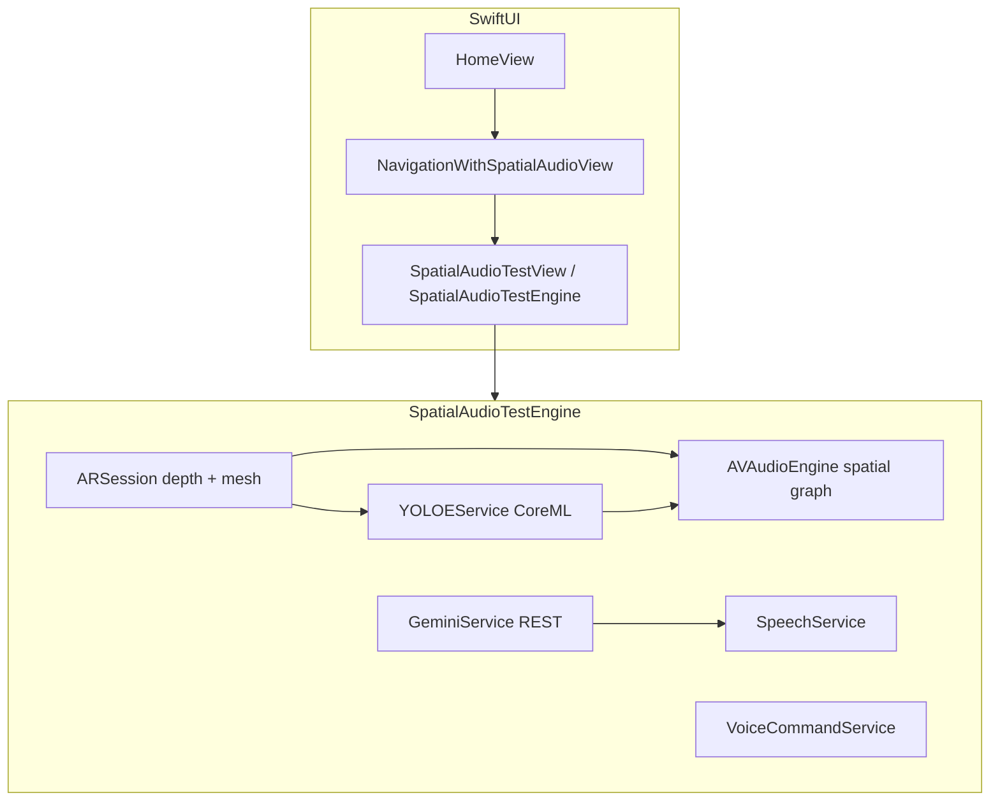

# BlindSight / BlindNav

iOS accessibility app for indoor guidance: voice or typed destination, on-device **YOLOE** (open-vocabulary) tracking, **Google Gemini** (`gemini-2.5-flash`) for subgoals, **ARKit** scene depth + mesh (LiDAR where available), and **spatial audio** (including head tracking with compatible headphones).

The shipping UI entry point is **`BlindSightApp`**. The Xcode target and bundle live under **`blindpplapp/`**.

## How a session works

1. **Home** — User grants camera + speech permissions, then speaks or types a destination (e.g. bathroom, exit).
2. **Full-screen navigation** — `NavigationWithSpatialAudioView` presents `SpatialAudioTestView`, backed by **`SpatialAudioTestEngine`**.
3. **ARKit** — Own `ARSession`: depth semantics, optional mesh anchors, world-locked obstacle clicks, camera path sampling.
4. **Gemini** — JPEG snapshots from the live frame choose / refresh **secondary goals** (text prompts for YOLOE).
5. **YOLOE (Core ML)** — `YOLOE11S.mlpackage` tracks the current prompt; guidance combines beeps, obstacle zones, and TTS.
6. **Voice commands** — Wake word (`BNConstants.voiceCommandWakeWord`, default **“phone”**) routes follow-up questions through Gemini with the latest snapshot.

## Architecture (runtime)



### `NavigationEngine` (secondary)

`HomeView` still constructs **`NavigationEngine`** on first appear so **`SpeechService`** (listen / TTS before navigation), **`GeminiService`** reconfiguration from Settings, and performance sliders apply to **`YOLOEService`** / **`DepthEstimationService`**. Its **`start(destination:)`** navigation path is **not** wired from the current home flow (all active navigation is `SpatialAudioTestEngine`). Keeping it allows future unification or testing without deleting the LiDAR depth + mesh → `SpatialAudioService` pipeline.

## Repository layout

| Path | Role |
|------|------|
| `blindpplapp/` | App sources, `Info.plist`, assets, `Resources/` (entitlements, `YOLOE11S.mlpackage`) |
| `blindpplapp.xcodeproj/` | Xcode project (file-system synchronized group for `blindpplapp/`) |
| `ModelConversion/` | Python scripts to export / download Core ML models |

## Requirements

- **Device**: iPhone with a back camera; **LiDAR + mesh** improve obstacles and mesh features (Pro models).
- **OS / tools**: Matches your project settings in Xcode (currently **iOS 26.x** deployment in `project.pbxproj` — adjust if you need an older floor).
- **API**: Gemini key from [Google AI Studio](https://aistudio.google.com/) (stored locally; optional default in `BNConstants` for development only — rotate keys for anything public).

## Setup

1. Open **`blindpplapp.xcodeproj`** in Xcode.
2. Set your **team** and bundle id if needed (`PRODUCT_BUNDLE_IDENTIFIER` in build settings).
3. Ensure **`blindpplapp/Resources/YOLOE11S.mlpackage`** is present (or re-export from `ModelConversion/export_yoloe_coreml.py`).
4. Add your Gemini API key in **Settings** inside the app (or rely on your configured default for dev).
5. Run on a **physical device** (ARKit + camera; simulator is not sufficient for real navigation).

### Optional: regenerate Core ML assets

```bash
cd ModelConversion
pip install -r requirements.txt
python export_yoloe_coreml.py
# Other scripts (e.g. midas / ground seg) exist for experiments; the current app uses LiDAR depth in-engine, not MiDaS in the main path.
```

Place exported packages under `blindpplapp/Resources/` and add them to the target if you introduce new models.

## Permissions

Declared in `Info.plist` / build settings: **Camera**, **Microphone**, **Speech Recognition**, **Motion** (head tracking for spatial audio).

## Safety and limitations

- Obstacle feedback is **assistive**, not a substitute for a cane, dog, or human guide.
- Network calls to Gemini require connectivity; YOLOE and ARKit run on-device.
- Two engines (`NavigationEngine` vs `SpatialAudioTestEngine`) share concepts but only the latter drives the current user-facing navigation UI.

## License

Research and accessibility use unless you add your own terms.
